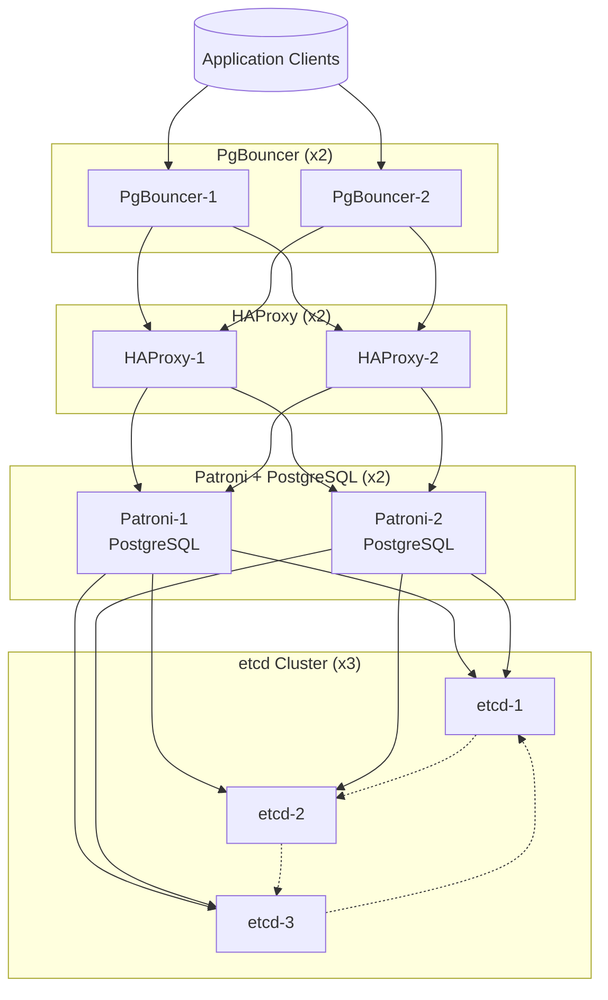

# High Availability PostgreSQL Stack Setup

This guide covers the installation and configuration of **etcd**, **PostgreSQL + Patroni**, **HAProxy**, and **PgBouncer** for a highly available PostgreSQL cluster.

---

## Architecture



---

## 1. ETCD Installation & Configuration

### Install etcd

```sh
wget https://github.com/etcd-io/etcd/releases/download/v3.6.4/etcd-v3.6.4-linux-amd64.tar.gz
tar -xvzf etcd-v3.6.4-linux-amd64.tar.gz
cd etcd-v3.6.4-linux-amd64/
mv etcd* /usr/local/bin
```

Check etcd commands:
```sh
etcd
etcdctl
```

### Configure etcd

```sh
sudo su
ETCD_NUMBER=etcd3 # Change this for each node
LOCAL_IP=$(hostname -I | awk '{print $1}')
ETCD1=192.168.50.210
ETCD2=192.168.50.106
ETCD3=192.168.49.34

cat > /etc/systemd/system/etcd.service <<EOF
[Unit]
Description=etcd - highly-available key-value store
Documentation=https://etcd.io/docs
After=network.target

[Service]
Type=notify
User=root
ExecStart=/usr/local/bin/etcd --name \$ETCD_NUMBER --initial-advertise-peer-urls http://\$LOCAL_IP:2380 \\
    --listen-peer-urls http://\$LOCAL_IP:2380 \\
    --listen-client-urls http://\$LOCAL_IP:2379,http://127.0.0.1:2379 \\
    --advertise-client-urls http://\$LOCAL_IP:2379 \\
    --initial-cluster-token etcd-cluster-1 \\
    --initial-cluster etcd1=http://\$ETCD1:2380,etcd2=http://\$ETCD2:2380,etcd3=http://\$ETCD3:2380 \\
    --initial-cluster-state new
Restart=on-failure
RestartSec=5s
LimitNOFILE=40000

[Install]
WantedBy=multi-user.target
EOF

systemctl enable etcd.service
systemctl start etcd.service
systemctl status etcd.service
```

### Validate etcd Cluster

```sh
ETCDCTL_API=3 etcdctl --endpoints=http://$ETCD1:2379,http://$ETCD2:2379,http://$ETCD3:2379 endpoint status --write-out=table
```

---

## 2. PostgreSQL & Patroni Installation

### Install PostgreSQL

```sh
sudo apt install curl ca-certificates
sudo install -d /usr/share/postgresql-common/pgdg
sudo curl -o /usr/share/postgresql-common/pgdg/apt.postgresql.org.asc --fail https://www.postgresql.org/media/keys/ACCC4CF8.asc
. /etc/os-release
sudo sh -c "echo 'deb [signed-by=/usr/share/postgresql-common/pgdg/apt.postgresql.org.asc] https://apt.postgresql.org/pub/repos/apt $VERSION_CODENAME-pgdg main' > /etc/apt/sources.list.d/pgdg.list"
sudo apt update
sudo apt -y install postgresql-17
```

### Install Patroni

```sh
su - ubuntu
sudo apt install python3-pip python3.12-venv
su - postgres
mkdir ~/patroni
cd ~/patroni
python3 -m venv venv
source venv/bin/activate
pip install patroni[psycopg3,etcd3]
```

### Patroni Configuration

```sh
sudo su
su - postgres

cat >> ~/.bashrc <<EOF
source ~/patroni/venv/bin/activate
export PATH=\$PATH:/usr/lib/postgresql/17/bin
export PATRONICTL_CONFIG_FILE=~/patronictl.yaml
EOF

openssl rand -base64 12
POSTGRES_PASSWORD=your_generated_password

psql -U postgres -c "ALTER USER postgres WITH PASSWORD '\$POSTGRES_PASSWORD';"

PATRONI_NUMBER=patroni1 # Change for each node
LOCAL_IP=$(hostname -I | awk '{print $1}')
ETCD1=192.168.50.210
ETCD2=192.168.50.106
ETCD3=192.168.49.34
PATRONI1=192.168.60.136
PATRONI2=192.168.55.35

cat > ~/patronictl.yaml <<EOF
scope: ha-db
name: \$PATRONI_NUMBER
restapi:
  listen: 0.0.0.0:8008
  connect_address: \$LOCAL_IP:8008
etcd3:
  hosts:
    - \$ETCD1:2379
    - \$ETCD2:2379
    - \$ETCD3:2379
bootstrap:
  dcs:
    ttl: 30
    loop_wait: 10
    retry_timeout: 10
    maximum_lag_on_failover: 1048576
    postgresql:
      use_pg_rewind: true
      pg_hba:
      - host replication replicator 127.0.0.1/32 md5
      - host replication replicator \$PATRONI1/32 md5
      - host replication replicator \$PATRONI2/32 md5
      - host all all 0.0.0.0/0 md5
      parameters:
        max_connections: 9000
        shared_buffers: 128MB
        work_mem: 32MB
        dynamic_shared_memory_type: posix
        log_destination: 'stderr'
        logging_collector: on
        log_line_prefix: '%m %d %u [%p]'
        log_timezone: 'Asia/Jakarta'
        datestyle: 'iso, mdy'
        timezone: 'Asia/Jakarta'
        lc_messages: 'en_US.UTF-8'
        lc_monetary: 'en_US.UTF-8'
        lc_numeric: 'en_US.UTF-8'
        lc_time: 'en_US.UTF-8'
        default_text_search_config: 'pg_catalog.english'
  initdb:
  - encoding: UTF8
  - data-checksums
postgresql:
  listen: \$LOCAL_IP:5432
  connect_address: \$LOCAL_IP:5432
  data_dir: data/postgresql
  authentication:
    replication:
      username: replicator
      password: \$POSTGRES_PASSWORD
    superuser:
      username: postgres
      password: \$POSTGRES_PASSWORD
    rewind:
      username: rewind_user
      password: \$POSTGRES_PASSWORD
  parameters:
    unix_socket_directories: '..'
tags:
  noloadbalance: false
  clonefrom: false
  nostream: false
EOF
```

### Patroni Systemd Service

```sh
sudo su

cat > /etc/systemd/system/patroni.service <<EOF
[Unit]
Description=High Availability PostgreSQL Cluster
After=syslog.target network.target

[Service]
Type=simple
User=postgres
Group=postgres
WorkingDirectory=/var/lib/postgresql
Environment=PATH=/usr/lib/postgresql/17/bin:/usr/local/sbin:/usr/local/bin:/usr/sbin:/usr/bin:/sbin:/bin
Environment=PATRONICTL_CONFIG_FILE=/var/lib/postgresql/patronictl.yaml
ExecStartPre=/bin/bash -c 'source /var/lib/postgresql/patroni/venv/bin/activate'
ExecStart=/var/lib/postgresql/patroni/venv/bin/patroni /var/lib/postgresql/patronictl.yaml
Restart=always
RestartSec=10s
TimeoutSec=30

[Install]
WantedBy=multi-user.target
EOF

systemctl enable patroni.service
systemctl start patroni.service
systemctl status patroni.service
```

---

## 3. HAProxy Installation & Configuration

### Install HAProxy

```sh
sudo apt install haproxy=2.8\*
```

### Configure HAProxy

```sh
sudo su
openssl rand -base64 12
HAPROXY_PASSWORD=your_generated_password

PATRONI1=192.168.60.136
PATRONI2=192.168.55.35

cat > /etc/haproxy/haproxy.cfg <<EOF
global
    log /dev/log    local0
    log /dev/log    local1 notice
    chroot /var/lib/haproxy
    stats socket /run/haproxy/admin.sock mode 660 level admin
    stats timeout 30s
    user haproxy
    group haproxy
    daemon
    ca-base /etc/ssl/certs
    crt-base /etc/ssl/private
    ssl-default-bind-ciphers ECDHE-ECDSA-AES128-GCM-SHA256:ECDHE-RSA-AES128-GCM-SHA256:ECDHE-ECDSA-AES256-GCM-SHA384:ECDHE-RSA-AES256-GCM-SHA384:ECDHE-ECDSA-CHACHA20-POLY1305:ECDHE-RSA-CHACHA20-POLY1305:DHE-RSA-AES128-GCM-SHA256:DHE-RSA-AES256-GCM-SHA384
    ssl-default-bind-ciphersuites TLS_AES_128_GCM_SHA256:TLS_AES_256_GCM_SHA384:TLS_CHACHA20_POLY1305_SHA256
    ssl-default-bind-options ssl-min-ver TLSv1.2 no-tls-tickets

defaults
    log     global
    mode    http
    option  httplog
    option  dontlognull
    timeout connect 5000
    timeout client  50000
    timeout server  50000
    errorfile 400 /etc/haproxy/errors/400.http
    errorfile 403 /etc/haproxy/errors/403.http
    errorfile 408 /etc/haproxy/errors/408.http
    errorfile 500 /etc/haproxy/errors/500.http
    errorfile 502 /etc/haproxy/errors/502.http
    errorfile 503 /etc/haproxy/errors/503.http
    errorfile 504 /etc/haproxy/errors/504.http

# PostgreSQL read/write (primary) service
listen postgres-primary
    bind *:15432
    mode tcp
    balance roundrobin
    option httpchk OPTIONS /master
    http-check expect status 200
    default-server inter 3s fall 3 rise 2 on-marked-down shutdown-sessions
    server patroni1 \$PATRONI1:5432 check port 8008
    server patroni2 \$PATRONI2:5432 check port 8008

# PostgreSQL read-only (replica) service
listen postgres-replica
    bind *:16432
    mode tcp
    balance roundrobin
    option httpchk OPTIONS /replica
    http-check expect status 200
    default-server inter 3s fall 3 rise 2 on-marked-down shutdown-sessions
    server patroni1 \$PATRONI1:5432 check port 8008
    server patroni2 \$PATRONI2:5432 check port 8008

# Patroni REST API
listen patroni-api
    bind *:7000
    balance roundrobin
    mode http
    option httpchk GET /
    http-check expect status 200
    server patroni1 \$PATRONI1:8008 check
    server patroni2 \$PATRONI2:8008 check

# HAProxy Statistics
listen stats
    bind *:8404
    stats enable
    stats uri /stats
    stats refresh 5s
    stats auth admin:\$HAPROXY_PASSWORD
    stats admin if TRUE
EOF

systemctl restart haproxy.service
systemctl status haproxy.service
```

---

## 4. PgBouncer Installation & Configuration

### Install PgBouncer

```sh
sudo apt update
sudo apt install -y autoconf automake libtool make gcc pkg-config libssl-dev libevent-dev pandoc
git clone https://github.com/pgbouncer/pgbouncer.git
cd pgbouncer
./autogen.sh
./configure
make
sudo make install
```

### Configure PgBouncer

```sh
su - ubuntu
LOCAL_IP=$(hostname -I | awk '{print $1}')
POSTGRES_PASSWORD=your_postgres_password

sudo mkdir /etc/pgbouncer
sudo chown -R 1000:1000 /etc/pgbouncer

cat > /etc/pgbouncer/userlist.txt <<EOF
"postgres" "\$POSTGRES_PASSWORD"
EOF

cat > /etc/pgbouncer/pgbouncer-rw.ini <<EOF
[databases]
* = host=\$LOCAL_IP port=15432

[pgbouncer]
listen_addr = *
listen_port = 5432
auth_type = md5
auth_file = /etc/pgbouncer/userlist.txt
pool_mode = transaction
max_client_conn = 200
default_pool_size = 20
EOF

cat > /etc/pgbouncer/pgbouncer-ro.ini <<EOF
[databases]
* = host=\$LOCAL_IP port=16432

[pgbouncer]
listen_addr = *
listen_port = 6432
auth_type = md5
auth_file = /etc/pgbouncer/userlist.txt
pool_mode = transaction
max_client_conn = 200
default_pool_size = 20
EOF
```

### PgBouncer Systemd Services

```sh
sudo su

cat > /etc/systemd/system/pgbouncer-rw.service <<EOF
[Unit]
Description=PgBouncer RW Service
After=network.target

[Service]
Type=simple
User=ubuntu
Group=ubuntu
ExecStart=/usr/local/bin/pgbouncer /etc/pgbouncer/pgbouncer-rw.ini
Restart=on-failure
RestartSec=5s
WorkingDirectory=/home/ubuntu

[Install]
WantedBy=multi-user.target
EOF

cat > /etc/systemd/system/pgbouncer-ro.service <<EOF
[Unit]
Description=PgBouncer RO (Replica)
After=network.target

[Service]
Type=simple
User=ubuntu
Group=ubuntu
ExecStart=/usr/local/bin/pgbouncer /etc/pgbouncer/pgbouncer-ro.ini
Restart=on-failure
RestartSec=5s
WorkingDirectory=/home/ubuntu

[Install]
WantedBy=multi-user.target
EOF

systemctl enable pgbouncer-rw.service
systemctl start pgbouncer-rw.service
systemctl status pgbouncer-rw.service

systemctl enable pgbouncer-ro.service
systemctl start pgbouncer-ro.service
systemctl status pgbouncer-ro.service
```